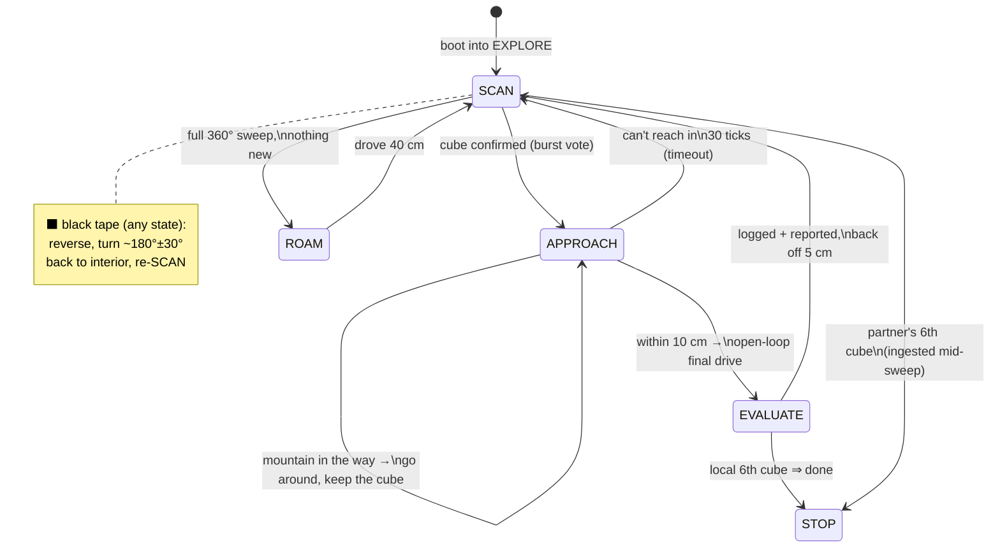

# 🤖 robotv3 — Autonomous Rover Firmware

> **TU/e 5EID0 · Venus Project · Group 10**
> A self‑contained, run‑on‑boot firmware for a PYNQ‑Z2 exploration rover that
> autonomously hunts coloured cubes, maps the terrain, and coordinates with a
> partner robot — talking to mission control over a single MQTT link.

`robotv3` is the **single‑file, autonomous, MQTT‑only** build of the rover. The
sensor stack, the VL53L0X ToF driver and the MQTT framing that used to live in
separate `.c` files are all **inlined into one `main.c`**, so deployment is a
single `gcc` command and a copy to the board — ideal for a *run‑on‑boot* service.

---

## ✨ Highlights

| | |
|---|---|
| 🧩 **One file** | `main.c` is fully self‑contained — no project headers, links against only `libpynq` + `libm`. |
| 🛰️ **MQTT‑only** | No operator, no `stdin`, no UI stream. Everything (pose, status, finds, terrain) goes out over **UART0 → ESP32 → MQTT broker**. |
| 🔌 **Run‑on‑boot** | Powers straight into autonomous `EXPLORE`; no arguments, no terminal needed. |
| 🧠 **Reactive autopilot** | A 4‑state roamer (`SCAN → APPROACH → EVALUATE → ROAM`) with a boundary‑evade interrupt. |
| 🤝 **Two‑robot mission** | Shares every cube find with a partner robot; both stop together once six cubes are known. |
| 🎯 **Robust detection** | Burst‑vote cube confirmation rides out noisy ToF dropouts; cubes are committed on detection strength, colour best‑effort. |

---

## 🛠️ Hardware & Pin Map

The rover carries a **vertical stack of three VL53L0X** time‑of‑flight sensors
(each aimed forward at a different height), an IR boundary pair, a colour sensor,
a thermistor, and two stepper‑driven wheels.

| Subsystem | Device(s) | Pins / Bus | Role |
|---|---|---|---|
| 🔦 **ToF — bottom** | VL53L0X `C` | IIC0, XSHUT `AR4`, addr `0x6A` | small **3×3 cm** cubes |
| 🔦 **ToF — middle** | VL53L0X `B` | IIC0, XSHUT `AR5`, addr `0x69` | large **6×6 cm** cubes |
| 🔦 **ToF — top** | VL53L0X `A` | IIC0 (always‑on), addr `0x68` | **mountains / obstacles** |
| 🧭 **ToF bus** | IIC0 | `AR_SCL` / `AR_SDA` | shared I²C for all three |
| ⬛ **IR tape** | 2× TCRT5000 | `AR9` (left), `AR10` (right) | black‑tape **boundaries / crater edges** |
| 🎨 **Colour** | TCS3200 | OUT `AR6`, S2 `AR7`, S3 `AR8`, S0 `AR11`, S1 `AR12` | cube **colour** classification |
| 🌡️ **Temperature** | NTC‑10K | `ADC5` | ambient **temp** logged with each cube |
| 📡 **Comms** | ESP32 (UART) | UART0 — RX `AR0`, TX `AR1` | **MQTT** uplink + partner link |
| ⚙️ **Drive** | 2× stepper | (libpynq stepper) | differential drive |

**Odometry** is dead‑reckoning integrated from the *commanded* steps (no wheel
encoders): `1600` steps/rev, **Ø 75 mm** wheels, **120 mm** track.

---

## 🏗️ Architecture at a glance

```
                ┌──────────────────────────────────────────────┐
   sensors ───▶ │  read_distance_sensors / tape / colour / temp │
                ├──────────────────────────────────────────────┤
   boot  ───▶   │  setup_hardware → MODE_EXPLORE                │
                │      └─ autopilot_step()  (every ~loop tick)  │
                │           SCAN · APPROACH · EVALUATE · ROAM   │
                │           + black-tape evade interrupt        │
                ├──────────────────────────────────────────────┤
   UART0  ◀──▶  │  MQTT: pose · status · mountain · black_tape  │
   (ESP32)      │        · ROCK (cubes)   ◀── partner finds     │
                └──────────────────────────────────────────────┘
```

* **No occupancy grid / SLAM** — `robotv3` is a *reactive roamer*. It reports
  terrain to mission control for mapping but navigates purely off live sensors +
  dead‑reckoned pose.
* **World frame** — both robots share origin `(0,0)` and integrate odometry in
  one common frame, so their cube coordinates are directly comparable with **no
  runtime transform**.

---

## 🎛️ Modes

The rover has a top‑level **mode** (`robot_mode_t`) and, inside `EXPLORE`, an
**autopilot state** (`ap_state_t`).

### Top‑level modes

| Mode | Active? | What it does |
|---|---|---|
| 🟢 **`EXPLORE`** | **Yes — the default** | Runs the autopilot every loop tick: scan, approach, evaluate, roam. The robot boots straight into this. |
| 🔴 **`STOP`** | Yes (terminal) | Entered the moment **all six cubes are known** (found by this robot or the partner). Motors are reset and the loop idles — mission complete. |
| ⚪ `TARGET` / `MANUAL` | **No (legacy)** | Operator drive / go‑to‑waypoint modes from the earlier tethered build. The `stdin` command interface that selected them was removed for the autonomous build, so they are never entered. |

### Autopilot states (within `EXPLORE`)



| State | Behaviour |
|---|---|
| 🔍 **`SCAN`** | Rotate **in place in 5° steps** (72 per revolution). On each step, look for the nearest unknown cube on the ToF beams; **confirm it with a 6‑read burst vote** (≥2 reads must agree within 5 cm) to ride out ToF dropouts. First confirmed, *not‑yet‑known* cube → remember its position and go to `APPROACH`. A full sweep with nothing new → `ROAM`. |
| 🚗 **`APPROACH`** | Drive toward the remembered cube. A **mountain in the way** (nearer than the cube) is gone *around* without dropping the goal. Once the cube is within **10 cm**, the last gap is driven **open‑loop** (the ToF can't read below ~6 cm) → `EVALUATE`. Can't reach it in 30 ticks → give up, back to `SCAN`. |
| 🎨 **`EVALUATE`** | Read the cube **colour** (averaged over 20 raw reads), then **register** the cube *on the strength of the confirmed detection* — a weak/`Unknown` colour never discards a real find. Report position + **size** (3 or 6 cm) + colour + **temperature** over MQTT, back off 5 cm → `SCAN`. The sixth cube triggers `STOP`. |
| 🧭 **`ROAM`** | Nothing found this sweep: turn a **random** direction, drive **40 cm**, → `SCAN`. Keeps the robot exploring new ground instead of freezing. |
| ⬛ **boundary evade** *(interrupt)* | At the **top of every tick**, if the IR sees black tape (a boundary / crater edge): **reverse off it, turn ~180° (±30° jitter) to face back toward the interior, abandon any approach**, and re‑`SCAN`. *The robot deliberately goes back rather than nudging forward, so it can't get pinned on the border.* |

---

## 🎬 Situations — how it reacts

| # | Situation | Reaction |
|---|---|---|
| 1 | **Boot, open area** | Spins a full 360° fine scan, sees nothing close → `ROAM` 40 cm to new ground → scan again. |
| 2 | **Small 3×3 cube ahead** | Bottom beam trips; burst‑vote confirms → `APPROACH` → open‑loop final → logged as **size 3**. |
| 3 | **Large 6×6 cube ahead** | Bottom **and** middle beams trip → tagged **size 6**, same approach + evaluate flow. |
| 4 | **A cube it (or the partner) already logged** | The detection is matched against the registry and **silently skipped** during `SCAN`; scanning continues. (If it *does* approach one that turns out already‑logged, `EVALUATE` publishes `cube_duplicate_ignored`.) |
| 5 | **Mountain while scanning** | Top beam in the 5–45 cm band → **mapped** to mission control as a `mountain`, *not* approached. |
| 6 | **Mountain between robot and a cube** | During `APPROACH`, it **steers around** the mountain (back‑off, 60° turn, sidestep) and keeps heading for the cube. |
| 7 | **Hits a boundary / crater edge (black tape)** | **Reverses, turns ~180° back toward the interior**, drops the current approach, re‑scans. |
| 8 | **Partner robot finds a cube** | Received over MQTT; a find **with a known colour** is folded into the **shared registry** (same world frame) — counts toward the six and de‑dupes future sightings. Partner frames with colour `Unknown` are skipped. |
| 9 | **Sixth cube known** | `stop_if_mission_complete` → `STOP`: steppers halted, `mission_complete_all_cubes_found` published. Because finds are shared, **both robots stop together**. |

---

## 📡 MQTT Protocol

All frames are JSON, sent to the ESP32 over UART0 (4‑byte little‑endian length
header + payload). The ESP32 relays them to the MQTT broker / mission control.

### Outbound (robot → mission control / partner)

| `type` | Payload | When |
|---|---|---|
| `pose` | `{"type":"pose","robot":"r1","x":<m>,"y":<m>,"theta":<rad>}` | every ~400 ms + on each transition |
| `status` | `{"type":"status","robot":"r1","mode":"explore","detail":"<event>"}` | on state changes + ~every 2 s (`alive`) |
| `mountain` | `{"type":"mountain","robot":"r1","x":<cm>,"y":<cm>}` | a mountain enters the top‑beam band (once per cell) |
| `black_tape` | `{"type":"black_tape","robot":"r1","x":<cm>,"y":<cm>}` | a boundary / crater edge is detected |
| `ROCK` | `{"type":"ROCK","x":"<cm>","y":"<cm>","color":"Red\|Green\|Blue\|Yellow\|White\|Unknown","size":3\|6,"temp":<°C>}` | a **new** cube is located |

**`status.detail` values:** `boot`, `alive`, `roaming`, `cube_detected`,
`cube_located`, `cube_duplicate_ignored`, `approach_timeout`,
`approach_avoid_mountain`, `evade_tape`, `tape_avoidance`,
`mission_complete_all_cubes_found`.

### Inbound (partner → robot)

The robot drains the UART each tick and parses the partner's `ROCK` frames. Each
genuinely new cube **that carries a known colour** is **folded into the shared
cube registry** (de‑duplicated within 12 cm) and counts toward the six‑cube
finish. Frames with colour `Unknown`, and relayed pose/status frames, are ignored.

---

## 🚀 Build & Run

Requires `libpynq` on the board.

```sh
# Robot 1  (start heading +y)
gcc main.c  -o robot1 $(pkg-config --cflags --libs libpynq) -lm

# Robot 2  (start heading -y) — built from main2.c, never both in one binary
gcc main2.c -o robot2 $(pkg-config --cflags --libs libpynq) -lm
```

Run it with **no arguments** — it brings up the hardware, announces over MQTT,
and starts exploring:

```sh
./robot1
```

For a true *run‑on‑boot* deployment, point your init / boot service at the binary
(stdout/stderr land in the boot log; all real telemetry is on MQTT).

### Robot 1 vs Robot 2

The two robots are *meant* to run the **same firmware**, differing only by
identity and a fixed start heading (baked in at compile time) so they share one
world frame and start back‑to‑back at the origin — which is what lets the
cross‑robot de‑dup and the joint six‑cube stop work with **no coordinate transform**.

| | Source | `ROBOT_ID` | Start pose |
|---|---|---|---|
| **Robot 1** | `main.c` | `r1` | `(0,0)`, θ = **+π/2** (faces **+y**) |
| **Robot 2** | `main2.c` | `r1` ⚠️ | `(0,0)`, θ = **−π/2** (faces **−y**) |

> ⚠️ **`main2.c` has drifted behind `main.c`.** This README documents `main.c`
> (Robot 1), the canonical build. `main2.c` is a *full standalone* build (not a
> thin wrapper) that currently **lags** it: it classifies colour with a **single**
> read (vs the 20‑read average in `main.c`), carries different tuning
> (`ROCK_APPROACH_M 0.06`, `COLOR_ALIGN_DIST_M 0.05`, `ROAM_DISTANCE_M 0.25`) and a
> different TCS3200 calibration, **and still defines `ROBOT_ID "r1"`** — so every
> frame is tagged `r1` and mission control can't tell the robots apart. To bring
> Robot 2 back in line, re‑sync `main2.c` from `main.c` and change *only*
> `ROBOT_ID → "r2"` and `START_THETA_RAD → −π/2`.

---

## ⚙️ Tuning Constants

The behaviour above is driven by a handful of `#define`s near the top of the
firmware section:

| Constant | Value | Meaning |
|---|---|---|
| `ROCK_DETECT_M` | `0.15` | bottom/middle ToF range that counts as a cube |
| `ROCK_APPROACH_M` | `0.02` | final stand‑off distance from the cube |
| `COLOR_ALIGN_DIST_M` | `0.10` | within this, the final approach is driven open‑loop |
| `CUBE_CONFIRM_READS` / `MIN_HITS` / `TOL` | `6` / `2` / `0.05 m` | burst‑vote cube confirmation |
| `SCAN_INCREMENTS` | `72` | in‑place sweep steps per 360° (= 5°/step) |
| `ROAM_DISTANCE_M` | `0.40` | straight‑line distance per roam leg |
| `BACKUP_M` | `0.08` | reverse distance on a boundary evade |
| `MOUNTAIN_DETECT_MIN/MAX_M` | `0.05` / `0.45` | top‑beam band that counts as a mountain |
| `MOUNTAIN_STOP_M` | `0.15` | mountain this close during approach ⇒ go around |
| `CUBE_DEDUP_RADIUS_M` | `0.12` | finds within this are the same cube |
| `TARGET_CUBE_COUNT` | `6` | cubes to find before the mission stops |
| `COLOR_EVAL_SAMPLES` | `20` | raw colour reads averaged before classifying |

> **ToF geometry note.** Detection assumes the **bottom** beam grazes floor‑cube
> height and the **top** beam sits above a 3–6 cm cube. The thresholds above were
> tuned against the on‑bench `debug_tof` readings; if a beam is mounted/aimed
> differently on your unit, re‑measure with `debug_tof` and adjust `ROCK_DETECT_M`.

---

## 🗂️ Repository layout

```
robotv3/
├── main.c     # Robot 1 — the complete single-file firmware
├── main2.c    # Robot 2 — standalone build, start heading -y (currently lags main.c — see ⚠️)
└── README.md  # you are here
```

> `robotv3` is the consolidated sibling of the multi‑file `robot/` build: same
> autonomous, MQTT‑only firmware, but with `sensors.c` / `vl53l0x.c` / `mqtt.c`
> inlined into the one translation unit.
